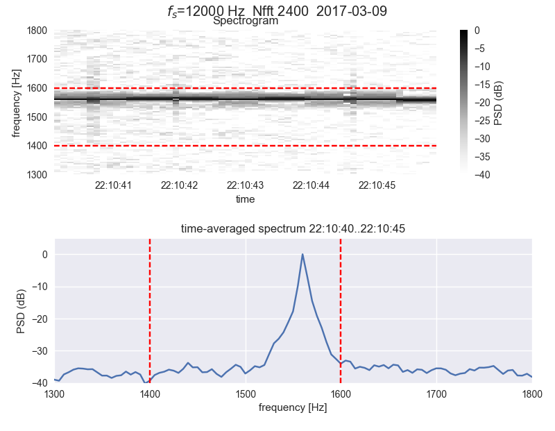
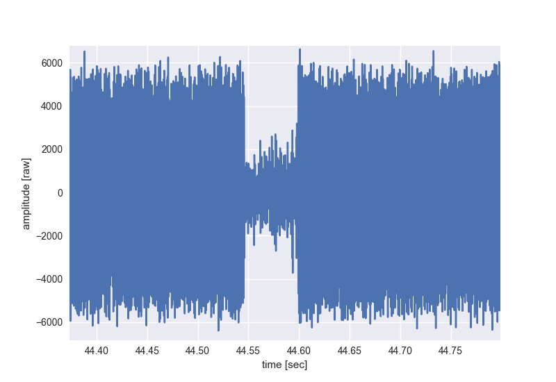

====================
WSPR Spectrum Plots
====================

Analysis of WSPR spectrum, in the face of fading and audio glitches.

Assumes you or a friend has the `.wav files saved by WSPR Save>Save All <https://www.scivision.co/wspr-save-raw-wav-data/>`_.

Glitches in spectrum (broadband hash) caused by dropouts on a UDP link. 
Interference is about -25 dB down by edge of WSPR.
That means if you're transmitting with 1 Watt (30 dBm) than the WSPR band gets pulses of hash with several milliwatts of power.

Correspondingly, if one was transmitting with 100 Watt (50dBm), the WSPR band is getting intermittant splashes of 1 Watt of power.

Here's what the dropouts looks like in the time domain:

The underlying theory of why this broadband hash happens on audio dropouts is analogous to key clicks.
An infinitely fast on-off transition requires infinite bandwidth. 
Here, the radio typically has about a 3 kHz audio filter that contrains the click bandwidth, and softens the on-off and off-on transitions necessarily.

With software defined radios, particularly those operated using Windows or where the transmit audio is sources remotely over the internet, dropouts will occasionally happen. 
If the dropouts are infrequent, the energy level is small despite large bandwidth. 
As the dropout frequency increases, the transmitted signal suffers (due to missed bits) and the interference energy rises as well.

Like key clicks, the bandwidth is proportional to steepness of rise (UDP dropouts are infinitely steep, limited by the radio transmit audio filter), and the rate of on-off, off-on. 
Operating 60 wpm CW with key clicks makes a lot of interference because of the high rate of transitions.
Operating WSPR or JT65 with a couple on-offs per minute is not as big a deal--unless you're using high power, then people within 3 kHz or so may notice.
   
